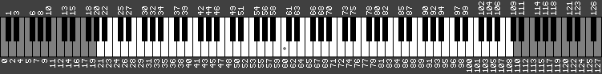

# polysynth
A lightweight multi-channel *(polyphonic)* audio library for the [Thumby](https://thumby.us), powered by the RP2040 PIO cores.

*This library is considered experimental and may be subject to change. At the very least, some housekeeping.*
## Overview
This library can be divided into three sections, each building on the previous:
### Core functionality
* Up to 7 audio channels (square wave by default). Any 4 of the audio channels can alternatively play pitch-controlled static.
* Pitch changes are applied seamlessly by default, allowing pitch bend and vibrato effects.
* Multiple writes can be queued at once allowing precise phase control and synchronization.
* Generates and outputs audio asynchronously with zero CPU usage.
### Sequencer
* Capable of playing music and sound effects in the background while other code runs.
* Uses a simple stream format, allowing large songs and alternative formats to be easily supported.
* Built-in support for "instruments", with various pitch and phase options.
* Multiple streams can play at the same time.
### Music loaders
#### MIDI file loader
* Allows loading and streaming of the vast majority of MIDI files.
* Supports both automatic and granular control over the mapping of channels and instruments.
#### MML loader
* Implements a relatively capable variant of MML *(Music Macro Language)*, a text based music notation.
* Allows music and complex sound effects to be easily made with no external tools.
## Usage
To use, you will need to add `polysynth.py` to your game folder and import it. This requires adding your game folder to the list of import paths:
```python
from sys import path as syspath
syspath.insert(0, "/Games/(your game folder)")
```
After this, you can import it:
```python
import polysynth
```
If you want to use MIDI, you will also need to include and import `midi.py`

Before playing sound, you **must** configure the channels:
```python
polysynth.configure() #use default configuration - all square waves
```
If you want to play static, you can pass a list of your desired layout. Any channels you don't specify are initialized as square waves:
```python
polysynth.configure([polysynth.SQUARE, polysynth.NOISE]) #channel 0 is square, channel 1 is static, 2-6 is square
```
Once initialized, it's ready for use. From this point you can enable channels, play tones, sound effects, songs, etc.

If you need to change the configuration, you can do so at any point.

*Note: If you change the clock speed with `machine.freq()`, you must also reconfigure the channels for pitches to be correct.*
### Examples
These assume that `polysynth`, `midi`, `time`, and `thumby` have all been imported.

Keep in mind that polysynth is capable of *much* more, these are just the basics.
#### Playing a chord
```python
polysynth.configure() #all square waves
polysynth.enabled(3) #turn on the first 3 channels
polysynth.setnote(0, 72) #channel 0, C
polysynth.setnote(1, 76) #channel 1, E
polysynth.setnote(2, 79) #channel 2, G
time.sleep(3)
polysynth.stop()
```
#### Crash sound
```python
polysynth.configure([polysynth.NOISE])
polysynth.enabled(1)
pitch = 8000.0
for i in range(500):
    polysynth.setpitch(0, pitch)
    pitch *= 0.99
    time.sleep_ms(1)
polysynth.stop()
```
This can also be done with an *instrument*, see example 4
#### Playing a song
*([2ChannelTest.mid](./assets/2ChannelTest.mid))*
```python
polysynth.configure()
song = midi.load(open("2ChannelTest.mid", "rb"))
polysynth.play(song) #playing a loaded MIDI file automatically sets the needed channel count by default
while polysynth.playing:
    time.sleep_ms(100)
polysynth.stop() #this shouldn't be necessary since the song ended on it's own, but it's a good idea to call at the end just to be be sure
```
#### Looping song, sound effect
*([2ChannelTest.mid](./assets/2ChannelTest.mid))*
```python
polysynth.configure([polysynth.NOISE])
song = midi.load(open("2ChannelTest.mid", "rb"), reserve={0:[]}) #reserve channel 0 for no specified instruments - this makes the song never use it
polysynth.play(song, loop=True)
while polysynth.playing:
    if thumby.buttonA.justPressed():
        polysynth.playnote(0, 125, polysynth.instrument(rise=-50, length=500)) #start at note 125, decrease by 50 per second, for 500 milliseconds
    if thumby.buttonB.justPressed():
        polysynth.stop()
    thumby.display.update()
```
**For a more complex example, see [PSdemo](./PSdemo) *(video [here](./assets/polysynth-demo-recompressed.mp4))***
## Documentation
### Core functions
#### polysynth.configure(*types=None, corecount=7*)
Sets up PIO cores.
* *types* is a list containing the desired channel types, either *polysynth.SQUARE* or *polysynth.NOISE* in any combination. Up to 7 types can be specified, of which only 4 can be *NOISE*. Any channels that are not specified default to *SQUARE*.
* *corecount* is how many PIO cores to dedicate to audio channels. **This should never be changed unless you need to save PIO cores for another purpose, it currently breaks functionality**
#### polysynth.enabled(*value=None*)
Returns the current number of enabled channels.
* *value* is a number from 0 to 7. If set, it will enable the given number of channels. If 0 are enabled, the channels will be paused, allowing up to 4 pitch changes per channel to be queued.
#### polysynth.stop(*mixer=True, chan=True, song=True*)
Stops one or more components from playing.
* *mixer* will set the enabled channel count to 0
* *chan* will clear the pitch on every channel
* *song* will stop the audio timer and stop/reset all streams
#### polysynth.setpitch(*chan, pitch*)
Set a channel's pitch in hertz.
* *chan* is a number from 0 to 6
* *pitch* is a number, either integer of float. Setting pitch to None or 0 will disable output. Disabling output will clear the internal counter.
#### polysynth.setnote(*chan, pitch*)
Set a channel's pitch to a specific note, according to MIDI note numbering
* *chan* is a number from 0 to 6
* *pitch* is a number, either integer of float. Setting pitch to None will disable output. Disabling output will clear the internal counter.
### Sequencer functions
#### polysynth.playing
* *True* if the audio timer is running. Not a function.
#### polysynth.updaterate(*value=None*)
Returns the speed that the audio timer set to run at. By default, 50 times per second.
* *value* is a number typically from 50 to 200. If set, it will immediately change the update rate, restarting the timer if necessary. Increasing this will improve timing accuracy (at the cost of higher CPU usage), which may improve the sound of fast songs or sound effects.
#### polysynth.instrument(*phaselock=False, phase=None, detune=0, vibspeed=0, vibamount=0, rise=0, length=None*)
Returns an instrument for use in the sequencer.
* *phaselock* will ensure all pitch changes in the same audio tick are written on the same clock cycle, allowing perfect phase synchronization between channels. **This currently requires briefly pausing output, which may result in an audible click**.
* *phase* is a float from 0 to 2, how many half-cycles to offset the phase by (0.5 would be 90 degrees out of phase, 1 is 180, 1.5 is 270, etc). This automatically enables *phaselock* while playing.
* *detune* is a float, midiPitch.
* *vibspeed* is a float, vibrato speed in hertz.
* *vibamount* is a float, vibrato intensity in midiPitch (+/-, 1.0 would vary from the note above to the note below the intended real note). **This continuously changes the pitch and should not be used with *phaselock***
* *rise* is a float, how much the note changes in midiPitch per second. **This continuously changes the pitch and should not be used with *phaselock***
* *length* is the duration before the note automatically stops, milliseconds.
#### polysynth.playnote(*chan, pitch, ins=None*)
Functionally the same as *polysynth.setnote*, except an instrument can be specified.
* *chan* is a number from 0 to 6
* *pitch* is a number, either integer of float. Setting pitch to None will disable output. Disabling output will clear the internal counter.
* *ins* is a sequencer instrument. This will start the audio timer if needed.
#### polysynth.play(*song, ins={}, autoenable=True, loop=False, speed=1, transpose=0*)
Start playing a song or sound effect in the background. This will start the audio timer if it isn't already running. Returns a unique stream ID which can be used to refer to the actively playing sound later on.
* *song* is a list of sequencer events. This is internally wrapped in a stream class and played as a stream.
* *ins* is a dict of sequencer instruments. Each entry is insName:instrument. Notes will automatically use their specified instrument if it's in the dict. *insName* can be any valid dict key, but with loaded MIDI files it will be a number from 0 to 127, directly mapping to MIDI instrument numbers.
* *autoenable* determines if the event stream is allowed to change the number of enabled channels.
* *loop* will loop the song, if supported by the stream type (guaranteed in this case).
* *speed* is a speed multiplier (0.5 would play at half speed, 2 would play at double speed, etc).
* *transpose* adjusts the pitch in notes (12 would increase the pitch by an octave, -12 would decrease it by an octave, etc).
#### polysynth.playstream(*song, ins={}, autoenable=True, loop=False, speed=1, transpose=0*)
Functionally identical to *polysynth.play*, except *song* is a stream of events rather than a list of events.
#### polysynth.stopstream(*streamID*)
Stops and resets the corresponding stream if it's currently playing.
### MIDI functions
#### midi.load(*data, mute=None, solo=None, reserve={}, automap=True, callbacks={}*)
Load a MIDI file and return a list of events ready for playback. This will determine the necessary number of channels to play the song, and insert an event at the beginning to enable that many channels.
* *data* is an open file or file-like object, seeked to the start of a MIDI file.
* *mute* is a list or set of MIDI instrument numbers. They will be ignored while loading.
* *solo* is a list or set of MIDI instrument numbers. If specified, they will be the **only** instruments loaded.
* *reserve* is a dict of physical channels (0-6), reserved for specific instruments. Each entry is channelNum:\[insNumbers\]. If a channel is reserved, only the designated MIDI instruments are allowed to play on it. Additionally, the given instruments are **only** allowed to play on their designated channel, and will overwrite whatever is playing on the channel. *NOISE* channels should always be reserved, even if they are not used in the song, to prevent them being unintentionally used for melodic instruments. Reserved channels should be the lowest numbered possible, especially if they aren't used in the song, to prevent them from being beyond the *enabled* range.
* *automap* determines if the loader automatically assigns notes to available channels. If False, MIDI channels will correspond directly to physical channels.
* *callbacks* is a dict of functions to insert into the event stream. Each entry is insNumber:func. If a note is played with the given MIDI instrument number, instead of playing the note, it will run the function, passing the midiPitch of the note as an argument.
#### midi.loadstream(*data, mute=None, solo=None, reserve={}, automap=True, callbacks={}*)
Functionally identical to *midi.load* except it returns a stream instead of a list. Does not change the enabled channel count as it can't be determined without loading the whole file.
**If you have enough memory to fully load a song, it is always recommended to prefer *midi.load* over *midi.loadstream* as parsing the file on the fly uses more resources and can result in subtle timing inaccuracies**
### MML functions
#### mml.load(*data, callback=None*)
Load a MML sequence and return a list of events ready for playback. This will determine the necessary number of channels to play the song, and insert an event at the beginning to enable that many channels. MML songs containing infinite loops must be opened with *mml.loadstream* as it's impossible to preload infinitely many events.
* *data* is a string or similar containing a MML song or sound effect.
* *callback* is a function that will be run any time a `@run` command occurs in the song. The function will be passed the number given to the `@run` command.
#### mml.loadstream(*data, callback=None*)
Functionally identical to *mml.load* except it returns a stream instead of a list.
### Sequencer stream format
The sequencer currently only supports the following event types. Each is a tuple starting with the timestamp in milliseconds, and it's designated number. They are:
* *Note off* - (timestamp_ms, 0, channelNum)
* *Note on* - (timestamp_ms, 1, channelNum, midiPitch, instrumentName)
* *Set enabled channel count* - (timestamp_ms, 2, channelCount)
* *Run a callback function* - (timestamp_ms, 3, function, data) - data is usually repurposed midiPitch, but can be anything.
* *Do nothing* - (timestamp_ms, None) - All unrecognized event types do nothing, but None is guaranteed to never be assigned in the future. Useful for maintaining silence at the end of a song.

These can be stored in a list and played with *polysynth.play*, or they can be provided by a stream class with the following structure:
* *nextevent* - A variable containing the next event. If None, the stream has ended.
* *readevent()* - A function that puts the next event in *nextevent* variable.
* *reset()* - A function that starts the stream from the beginning, if possible. **Must return True if it *does* reset, False if it *doesn't***. Streams will be automatically reset when they end or are stopped.
## MML syntax
MML *(Music Macro Language)* is a simple way or representing music with text. Variants of MML were widely used for video games in the 80s and 90s, and it remains in use for chiptunes today.

Not all variants of MML have the same features or syntax. This documentation only applies to this specific variant.
### Structure
An MML sequence is divided into sections, each marked with an exclamation point `!`. Sections can either be audio channels, or macros.

Comments are marked with a semicolon `;`. Anything after a semicolon on a given line of text is ignored.
#### Channels
Each channel is started with the command `!channel n` where *n* is the audio channel used (0 to 6). **Each song must have at least one channel.**

All channels play simultaneously and in lockstep. The song's tempo is shared across all channels, but other playback parameters are unique to each.
#### Macros
Macros contain snippets of MML that can be reused multiple times in a song.

Each macro is started with the command `!macro n` where *n* is a number you can use to invoke it.

Macros must be defined in the file at some point before they're used.

Macros can contain references to other macros, provided they're defined earlier.
### Commands
Commands control various playback parameters. Each is marked with an `@`, and requires a positive integer number after it.
* `@tempo n` - set the tempo of the song in beats per minute (default 120)
* `@notesPerBeat n` - set how fast notes are played (default 1)
* `@instrument n` - set what sequencer instrument to use (default None)
* `@lengthOfNote n%` - set the duration each note is actually played for (default 100%). 75% for instance would play sound for 75% of one note, followed by a gap for 25% of one note.
* `@octave n` - set the current octave notes are played in (default 5, the lowest note of which is middle C)
* `@macro n` - insert a macro at this location. Macros behave like copying+pasting their contents at this location.
* `@run n` - run the provided callback function with the argument *n*

**Only the first letter of a command is required.** For instance, `@lengthOfNote 50%` can simply be written as `@L50`.
### Notes
`C`, `D`, `E`, `F`, `G`, `A`, and `B` will play the given note in the current octave.

Any note can be followed by a sharp `#` to increase it by a half step (for instance, `c#`)

Additionally, any note can also be followed by a number as a shorthand to set the octave (for instance, `c4` or `c#4` are equivalent to `@o4 c` or `@o4 c#`)

A period `.` is treated as a rest and will play nothing.

A dash `-` will seamlessly continue the previous note. Note that a `@lengthOfNote` of less than 100% is ignored on the previous note, and will only apply on the final dash of a sustained note.

`>` and `<` will increase and decrease the current octave by 1 respectively.
### Loops
Loops are created with brackets `(` and `)`, with the opening bracket followed by the loop count (for instance, `(3 cdefgab>c<)` plays a scale 3 times).

If the loop count is 0, the loop will continue infinitely.
### Formatting
Commands/sections only require the first letter, and text outside of command/note definitions is ignored. Everything is also case-insensitive. This means that:
```
!Channel 0 ;only one channel here
@notes per beat 4
@length 80%
(3 C6 D D# D) C - - -
```
is equivalent to
```
!c0@n4@l80(3c6dd#d)c---
```
Despite extraneous text outside of commands being ignored (like the `%` in the above example), it's probably best to avoid it in case it conflicts with future commands.
## Additional details
### MIDI note numbering/midiPitch


For convenience, several components of this use MIDI note numbering, even those that are not related to the MIDI section itself.

MIDI uses one number per note, ranging from 0 to 127, extending both below and above the full range of a piano (highlighted above). Middle C is number 60, for instance.

All functions in this library that accept midiPitch tolerate floats, and numbers *beyond* the normal MIDI range (though there's not much point since they rapidly exceed audible range).
### Volume
Audio is always output at maximum volume, split evenly between the enabled channels. The fewer channels that are enabled, the louder each individual one will be.
### Stream priority
If multiple streams try to use the same channel simultaneously, the stream that started more recently gets priority.
### Use on other RP2040 devices
As long as the PIO isn't already in use, this will function on any RP2040 device, provided that GPIO pins `7, 8, 9, 10, 11, 21, 22,` and `25` are disconnected and not in use. Audio will be output on GPIO 28, using PWM at above-audible frequencies.

It was developed and tested on a Raspberry Pi Pico (pin 25 being used for the LED doesn't seem to affect it).
## Limitations
#### New pitches aren't applied to channels until the next half-cycle of their current pitch
With very low pitches (less than ~20 hertz), the delay before the new pitch is applied can start to become noticeable. Absurdly low pitches (less than 1 hertz) can take several seconds before a new pitch is applied.

This can be mitigated by clearing the pitch before setting a new one.
#### Synchronizing the phase of multiple channels requires pausing *all* output
Phase control requires queueing multiple pitch changes, which is not possible without setting the enabled channel count to 0 while writing.

This cannot be fixed without changing how synchronization works in the PIO programs.
#### Certain functions may interfere with timing precision within the sequencer
The sequencer uses `machine.Timer` at 50 hertz to update pitches. Certain functions, notably *native* and *viper* functions, cannot be interrupted by this. If such a function takes too long to run, it can audibly degrade note timing.

#### MIDI CCs and channel 10 (percussion) are ignored
To save on complexity, MIDI CCs are discarded. Pitch bend currently has to be implemented using the *rise* argument in a *polysynth.instrument*.

MIDI Channel 10, reserved for percussion, is currently discarded both because the configuration of *NOISE* channels is unknown, and to eliminate the need for a drum database. Percussion can still be used by manually reserving instrument(s) for playback on *NOISE* channels.

#### Only square wave playing on channel 0 will play in the emulator
Full functionality requires features that aren't currently emulated. Accuracy is not guaranteed.
## Other stuff
This was originally supposed to be a quick experiment to learn the PIO for an unrelated project, but feature creep got to me, and now here we are. In it's current state, it is rougher than I wanted it to be, but I haven't been able to program much recently and wanted to get a usable version released sooner than later. Despite my desires to clean and optimize the code more before release, it is currently perfectly usable.
